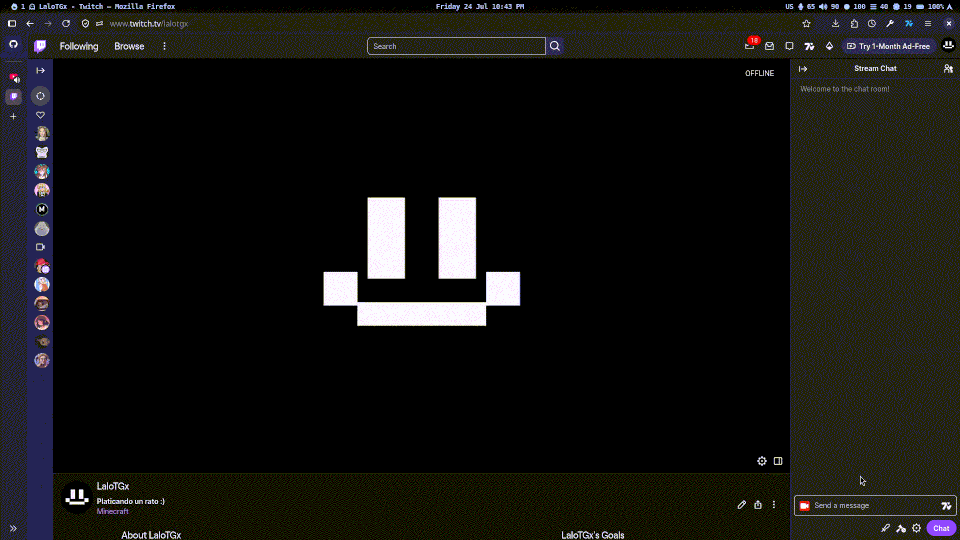
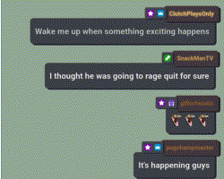

## Digital Creator
Repositorio que reúne herramientas desarrolladas para automatizar tareas,
mejorar transmisiones en vivo y facilitar la creación de contenido digital.

## Contenido
- 🎥 Automatización para la creación de contenido.
- 🎮 Utilidades para transmisiones en vivo.
- 🐍 Scripts desarrollados en Python.
- 🎨 Herramientas para animaciones en pixel art.
- 💬 Recursos para mejorar la interacción con el chat.

---

## Herramientas
- [NotifyMsgTwt](#notifymsgtwt)
- [SpriteKit](#spritekit)
- [Streamlabs ChatBox Overlay](#streamlabs-chatbox-overlay)

---

### NotifyMsgTwt
Herramienta desarrollada en Python que muestra los mensajes del chat de Twitch como notificaciones nativas del sistema.
Está pensada para quienes realizan transmisiones y desean mantenerse al tanto del chat sin depender de un segundo monitor o de revisar el teléfono.
De esta forma, es posible mantener la atención en el contenido sin perder la interacción con la audiencia.

Compatible con Arch Linux + Hyprland, aunque puede adaptarse a otros entornos de escritorio con las modificaciones necesarias.

---

### SpriteKit
Herramienta desarrollada en Python para generar imágenes y videos a partir de spritesheets creados en Aseprite.
Procesa automáticamente cada frame del spritesheet, reconstruye la animación y permite posicionarla mediante un sistema de
anclajes 3×3 (Top Left, Top Center, Top Right, Center Left, Center, Center Right, Bottom Left, Bottom Center y Bottom Right).
Permite automatizar la generación de animaciones en pixel art para intros, overlays, escenas o cualquier otro recurso audiovisual.

---

### Streamlabs ChatBox Overlay
Plantilla de chat overlay desarrollada con HTML, CSS y JavaScript para mostrar mensajes durante transmisiones en vivo.
Está diseñada para utilizarse con Streamlabs, aunque puede servir como base para adaptarse a otros gestores de overlays
según las necesidades del proyecto.

